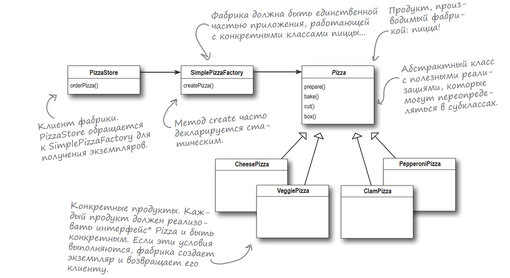
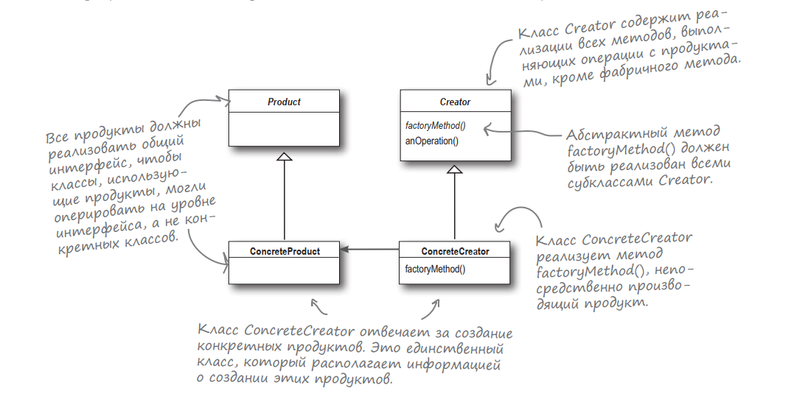
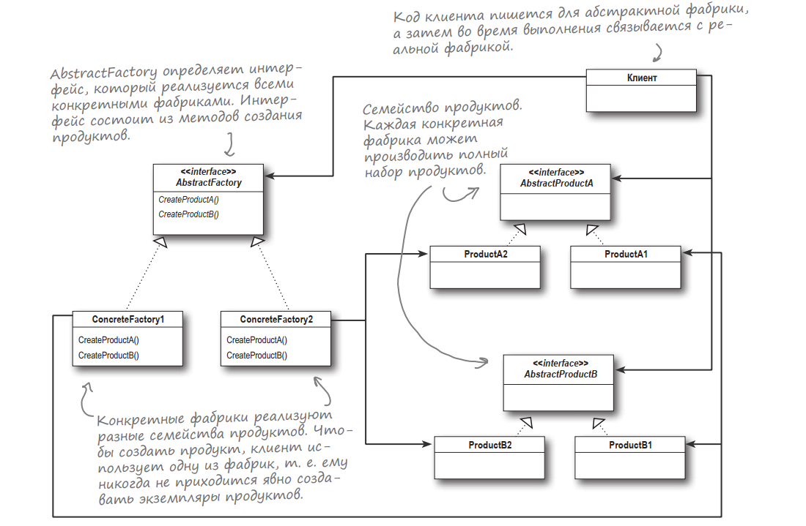

#Простая фабрика
Простая фабрика 

#Фабричный метод
**Паттерн Фабричный Метод** определяет интерфейс создания
объекта, но позволяет субклассам выбрать класс создаваемого экземпляра. Таким образом, Фабричный Метод делегирует
операцию создания экземпляра субклассам.

#Абстрактная фабрика
**Паттерн Абстрактная Фабрика** предоставляет интерфейс создания семейств взаимосвязанных или взаимозависимых
объектов без указания их конкретных классов
